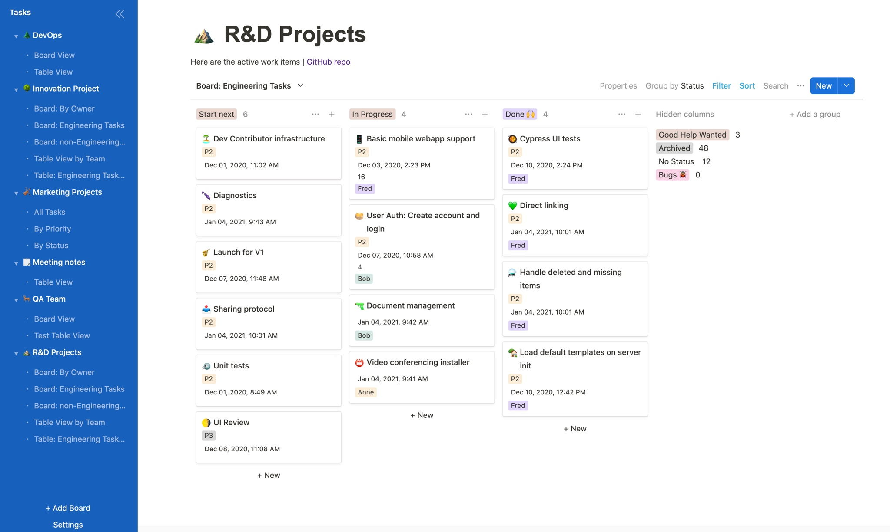

> [!WARNING]
> This repository is currently not maintained. If you're interested in becoming a maintainer please [let us know here](https://github.com/mattermost-community/focalboard/issues/5038).
>
> This repository only contains standalone Focalboard. If you're looking for the Mattermost plugin please see [mattermost/mattermost-plugin-boards](https://github.com/mattermost/mattermost-plugin-boards).
>

# Focalboard




Focalboard is an open source, multilingual, self-hosted project management tool that's an alternative to Trello, Notion, and Asana.

It helps define, organize, track and manage work across individuals and teams. Focalboard comes in two editions:

* **[Personal Desktop](https://www.focalboard.com/docs/personal-edition/desktop/)**: A standalone, single-user [macOS](https://apps.apple.com/app/apple-store/id1556908618?pt=2114704&ct=website&mt=8), [Windows](https://www.microsoft.com/store/apps/9NLN2T0SX9VF?cid=website), or [Linux](https://www.focalboard.com/download/personal-edition/desktop/#linux-desktop) desktop app for your own todos and personal projects.

* **[Personal Server](https://www.focalboard.com/download/personal-edition/ubuntu/)**: A standalone, multi-user server for development and personal use.

## Try Focalboard

### Personal Desktop (Windows, Mac or Linux Desktop)

* **Windows**: Download from the [Windows App Store](https://www.microsoft.com/store/productId/9NLN2T0SX9VF) or download `focalboard-win.zip` from the [latest release](https://github.com/mattermost/focalboard/releases), unpack, and run `Focalboard.exe`.
* **Mac**: Download from the [Mac App Store](https://apps.apple.com/us/app/focalboard-insiders/id1556908618?mt=12).
* **Linux Desktop**: Download `focalboard-linux.tar.gz` from the [latest release](https://github.com/mattermost/focalboard/releases), unpack, and open `focalboard-app`.

### Personal Server

**Ubuntu**: You can download and run the compiled Focalboard **Personal Server** on Ubuntu by following [our latest install guide](https://www.focalboard.com/download/personal-edition/ubuntu/).

### API Docs

Boards API docs can be found over at <https://htmlpreview.github.io/?https://github.com/mattermost/focalboard/blob/main/server/swagger/docs/html/index.html>

### Getting started

Our [developer guide](https://developers.mattermost.com/contribute/focalboard/personal-server-setup-guide) has detailed instructions on how to set up your development environment for the **Personal Server**. You can also join the [~Focalboard community channel](https://community.mattermost.com/core/channels/focalboard) to connect with other developers.

Create an `.env` file in the focalboard directory that contains:

```
EXCLUDE_ENTERPRISE="1"
```

To build the server:

```
make prebuild
make
```

To run the server:

```
 ./bin/focalboard-server
```

Then navigate your browser to [`http://localhost:8000`](http://localhost:8000) to access your Focalboard server. The port is configured in `config.json`.

Once the server is running, you can rebuild just the web app via `make webapp` in a separate terminal window. Reload your browser to see the changes.

### Building and running standalone desktop apps

You can build standalone apps that package the server to run locally against SQLite:

* **Windows**:
  * *Requires Windows 10, [Windows 10 SDK](https://developer.microsoft.com/en-us/windows/downloads/sdk-archive/) 10.0.19041.0, and .NET 4.8 developer pack*
  * Open a `git-bash` prompt.
  * Run `make prebuild`
  * The above prebuild step needs to be run only when you make changes to or want to install your npm dependencies, etc.
  * Once the prebuild is completed, you can keep repeating the below steps to build the app & see the changes.
  * Run `make win-wpf-app`
  * Run `cd win-wpf/msix && focalboard.exe`
* **Mac**:
  * *Requires macOS 11.3+ and Xcode 13.2.1+*
  * Run `make prebuild`
  * The above prebuild step needs to be run only when you make changes to or want to install your npm dependencies, etc.
  * Once the prebuild is completed, you can keep repeating the below steps to build the app & see the changes.
  * Run `make mac-app`
  * Run `open mac/dist/Focalboard.app`
* **Linux**:
  * *Tested on Ubuntu 18.04*
  * Install `webgtk` dependencies
    * Run `sudo apt-get install libgtk-3-dev`
    * Run `sudo apt-get install libwebkit2gtk-4.0-dev`
  * Run `make prebuild`
  * The above prebuild step needs to be run only when you make changes to or want to install your npm dependencies, etc.
  * Once the prebuild is completed, you can keep repeating the below steps to build the app & see the changes.
  * Run `make linux-app`
  * Uncompress `linux/dist/focalboard-linux.tar.gz` to a directory of your choice
  * Run `focalboard-app` from the directory you have chosen
* **Docker**:
  * To run it locally from offical image:
    * `docker run -it -p 80:8000 mattermost/focalboard`
  * To build it for your current architecture:
    * `docker build -f docker/Dockerfile .`
  * To build it for a custom architecture (experimental):
    * `docker build -f docker/Dockerfile --platform linux/arm64 .`

Cross-compilation currently isn't fully supported, so please build on the appropriate platform. Refer to the GitHub Actions workflows (`build-mac.yml`, `build-win.yml`, `build-ubuntu.yml`) for the detailed list of steps on each platform.

### Unit testing

Before checking in commits, run `make ci`, which is similar to the `.gitlab-ci.yml` workflow and includes:

* **Server unit tests**: `make server-test`
* **Web app ESLint**: `cd webapp; npm run check`
* **Web app unit tests**: `cd webapp; npm run test`
* **Web app UI tests**: `cd webapp; npm run cypress:ci`

### Staying informed

* **Changes**: See the [CHANGELOG](CHANGELOG.md) for the latest updates
* **Bug Reports**: [File a bug report](https://github.com/mattermost/focalboard/issues/new?assignees=&labels=bug&template=bug_report.md&title=)
* **Chat**: Join the [~Focalboard community channel](https://community.mattermost.com/core/channels/focalboard)
